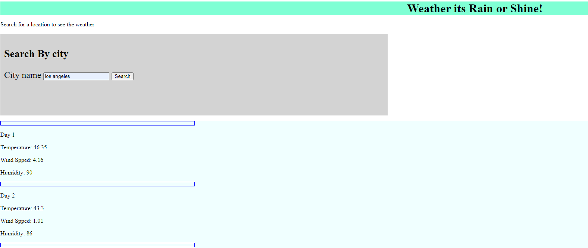

# StormReport
## Description

Provide a short description explaining the what, why, and how of your project. Use the following questions as a guide:

My motivation for this project was to be able to link the weather app API and use its data to structure a 5 day forcast.  This project presented many challenges from linking the API, to utilizing local storage, and generating the display with weather data dynamically.  This project also showed me how weak my CSS skills are and that I should revisit those lessons when time permits.  I was able to overcome my problems by collaborating with my classmates, studying with a tutor, and utilizing the AskBCS tool.  With their help I was slowly able to complete the weather app. What I learned the most from this project is how to structure fetch requests and dynamically generate the fields on the web app to display data.

## Usage

to view the weaher app please visit the following URL...

https://dannym15.github.io/StormReport/

when you launch the web app it should look something like this...

 

## Credits

A list of collaborators are as follows:
Marisol Aranda
Sarah Davila
Amanda Vilwock
Jacob Ferraro

## Features

If your project has a lot of features, list them here.

